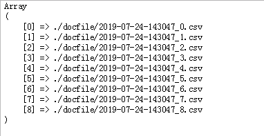
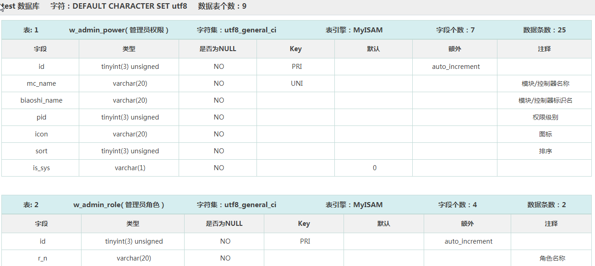

### 项目说明
通过配置 MySql 数据库信息，使用 PHP 生成数据表字典
可以输出在当前页面，可以生成文件保存在指定位置，也可以下载    
格式支持网页HTML格式、CSV格式（Excel 读取）、ZIP压缩格式      
数据库类型 MySql ,数据库连接方式使用 PDO , PHP 版本建议 5.5 以上  
生成的文件名可以自定义，支持中文，字符转换编码使用 `iconv` 函数，无法转换的字符将忽略（为空）      
如果是其他编码可以通过配置文件中`locationChar` `webChar`配置  
如果是生成文件保存到指定目录，返回的是数据文件目录地址
支持分卷，限制每个文件写入多少张表，防止数据表过多文件打开时响应时间过长; 如果生成数据类型 `type=echo`(直接输出)不支持分卷(分页)  
日志相关设置可通过修改配置项设置，`File` 类文件 `config` 属性自定义

**注意：**   
- 如果生成的 csv 文件中的数据是中文的，2007 版本的 office/Excel 打开乱码，高版本没有问题
- 配置项中 压缩、下载、分卷在 `fileType=>echo` 是忽略的
- PHP 需要开启 `mb` 扩展   
- 数据库字典文件的title 可在 `Ddit` 类中 `docTit()` 自定义设置，默认 `dbName."数据库字典"`

### 相比 2.0.4 版本
**调整** 
- 数据表添加字段个数统计，数据条数统计
- 字段类型输出调整 `字段,类型,是否为NULL,Key,默认,额外,注释`
- 调整HTML页面布局  

**增加** 
- 添加返回数组格式数据适用于自定义分页显示
- csv 格式文件添加是否输出 tit (`dbName."数据库字典"`) 配置 `csvIsTit=>false`

### 文件说明
src/     
|---docfile/		创建文件存放目录,可以通过配置自定义；**必须有写、创建文件的权限** 
|---file/			HTML 模板文件与样式文件,可以通过配置自定义；**必须有读写文件的权限** 
|---log/			日志文件夹,可以通过配置自定义；**必须有写、创建文件的权限** 
|---test/			示例图片目录       
|---.gitignore		GitHub 忽略文件      
|---Config.php		配置文件     
|---Ddic.php		生成数据字典核心类     
|---Derror.php		错误处理类文件     
|---File.php		生成 HTML/CSV 数据文件    
|---PdoSql.php		数据库操作文件      
|---demo.php		测试文件     
 

### 调用示例
Ddic/File/PdoSql 类使用时：实例化前传参数数组形式； 实例化后传参对象形式；   
例如：  
      `$config['fileExt']='csv'; 
       $Ddic=new Ddic($config);
       $Ddic->fileExt='csv';` 
      
结果示例：  

  

